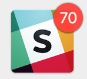
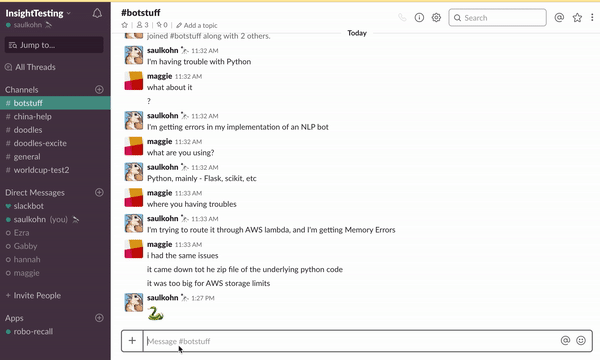

# robo-recall

Insight Data Science NYC, Summer 2018 - Saul A. Kohn

This library defines the interface and launchpad of `robo-recall`, an NLP bot to summarize what you missed on Slack.

## Slacking away

[Slack](https://www.slack.com) is an awesome productivity tool. It's used by 8 million people _daily_, at more than 500,000 organizations. However, users are only _active_ about half the time on they have the software open (TechCrunch 2016, Slack 2016). That leaves open the risk of missed messages.

 <- scary stuff.

Anyone who's a member of a group text knows the terror of the red bubble with "70 missed messages" written on it. But that shared experience exposes a deficiency in these tools: group chatting applications like Slack, or WhatsApp, or Facebook Messanger are built for the rapid exchange of ideas. When we have to read through a ream of messages that occured while we weren't looking, we're either not using the service correctly, or those services need to improve. 

Enter `robo-recall`.

## Summarization Required

`robo-recall` is a Slack bot that provides concise, topical summaries of all the stuff you missed on a busy Slack channel. There were [existing](http://autotldr.io/) [summarization tools](https://radimrehurek.com/gensim/summarization/summariser.html) available before `robo-recall`'s inception, but these were built for texts with _narrative structure_. That is, texts with beginnings, middles and ends. A family of algorithms called `TextRank` variants look for the "most representative sentence" out of a text, based on how many of its words are shared with the text as a whole. This works surprisingly well on stuff like news articles… but for dialogs, it just doesn't cut it. Here's a dialog texted between me and my friend Maggie while I was working on the project:

```
Saul: I'm having trouble with Python
Maggie: What about it?
Saul: I'm getting errors in my implementation of an NLP bot
Maggie: what are you using
Saul: Python, mainly - Flask, scikit, etc
Maggie: what's up with it
Saul: I'm trying to route it through AWS lambda
Saul: and I'm getting Memory Errors
Maggie: that happened to me once
Maggie: it's not the Python
Maggie: it came down to the zip file of the underlying Python code
Maggie: it was too big for AWS storage limits
```

The summary of this conversation using `TextRank` is: **"Python, mainly - Flask, scikit, etc."**. Which, sure, is _one_ of the things that came up, but it doesn't tell a very full story.

## The Pipe

I designed a pipeline to process Slack text and generate better summaries of them than TextRank could provide. The processing pipeline involved 3 or 4 major steps, which all had to complete within 3 seconds. More than this and Slack times-out on you. Also, the longer a summary takes to generate, the worse it is — someone would be better-off just reading the missed dialog, which is what we're trying to avoid here!

The first step is data ingestion and cleaning. Upon calling the bot, all missed messages are pulled from the history of that channel. Cleaning involves removal of stop words ("and", "I", "the", etc.), emojis and usernames.

We need to get a broad view of the topics discussed, before we dive in to specifics. To generate these, I created a topic model using [Latent Dirichlet Allocation](https://en.wikipedia.org/wiki/Latent_Dirichlet_allocation) (LDA). This algorithm models individual text documents as a mixture of a small number of topics — and every word in each document as evidence of a topic being present. People talk about _everything_ and I wanted `robo-recall` to be as multi-purpose a tool as possible. So I grabbed the biggest mixture of topics I could get my hands on: 4.6 MM wikipedia articles, which I modeled as containing 100 different topics, each topic with ~1000 words associated with it. I ran through the vocabulary of each topic and hand-labelled them. Almost all of them were very coherent (although one of the labels was "3 letter acronyms"). 

Typically one hands an LDA model a "bag of words" — a list of words in the document that match the vocabulary of the model — but I found that this introduced a little too much noise in to the problem. Instead, I generated a "bag of nouns" from the cleaned dialog, which improved topic detection considerably. 

Next I needed to get the nitty-gritty: who and what were chatted about? To achieve this, I used a pretrained Named Entity Resolution model within the [`spacy`](https://spacy.io/usage/linguistic-features#section-named-entities) package (which is freaking awesome). 

Finally, OK. `TextRank` is not ideal for dialog summarization. But it's idea of looking for shared words isn't a bad one! I reframed this idea as Outlier Detection; if a word is mentioned an erroneous number of times, it's probably an important one. I grab these, too.

Running the whole pipe together grants a rather good summary of my dialog! The `robo-recall` output for the dialog between me and Maggie is:



**Maggie and Saul talked about: data/software**

**Things that came up were:**

**- Python**

**- AWS and NLP**

That's quite a bit better than what TextRank could deliver!

## To summarize...

`robo-recall` catches you up on what you missed on Slack using machine learning and NLP techniques. It's built to be as multi-purpose as possible, and I'm confident that it could be plugged in to any service with streaming text dialog (e.g. WhatsApp), or even to get down to brass tacks on transcribed customer service calls.

[Check it out for yourself](https://github.com/SaulAryehKohn/rebo-recall)! And feel free to [get in touch](mailto:saul.aryeh.kohn@gmail.com) if you want to try running it in your own Slack organization. You just need to include some simple API keys that I'd be happy to talk you through getting.

Finally, I want this tool to have as broad a user base as possible. I'm open-sourcing it under an MIT License, and both Issues and Pull Requests are encouraged. Have fun!

#### Launch the bot:

`source environment_variables.sh` (avialable upon request).

`flask run summaryslash.py`
